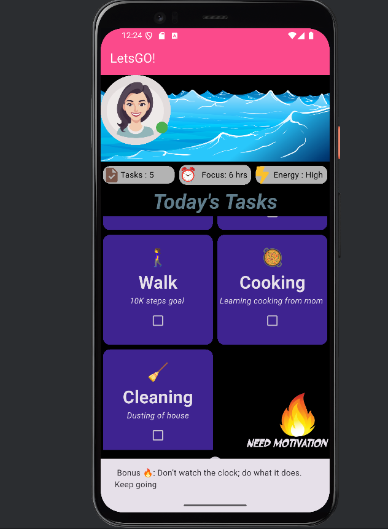

# 💪 Flutter Motivation Dashboard

A sleek and inspiring productivity dashboard built using Flutter.  
This app helps you track your daily tasks like workouts, walks, cooking, and study sessions — with a motivational fire boost!

---

## ✨ Features

- 🌙 **Dark Theme UI**
- 🧠 **Daily Task Cards**: Walk, Workout, Study, Cooking, Cleaning
- 🔥 **Motivational Boost Button**: Rotating quotes via SnackBar
- 🎯 **Progress & Stats Panel**: Tracks tasks, focus hours, and energy
- 🧩 **Modular Code** with reusable widgets
- 🔜 **Dynamic Task Addition (coming soon)**

---

## 📸 Screenshots

| Home Page                   | Task Grid |
|-----------------------------|-----------|
|  | 

---

## 🚀 Getting Started

### Prerequisites

- Flutter SDK
- Android Studio or VS Code with Flutter & Dart plugins

### Run Locally

```bash
git clone https://github.com/yourusername/flutter_motivation_ui.git
cd flutter_motivation_ui
flutter pub get
flutter run
